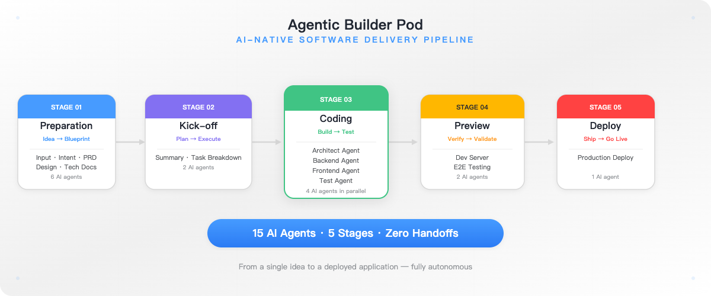
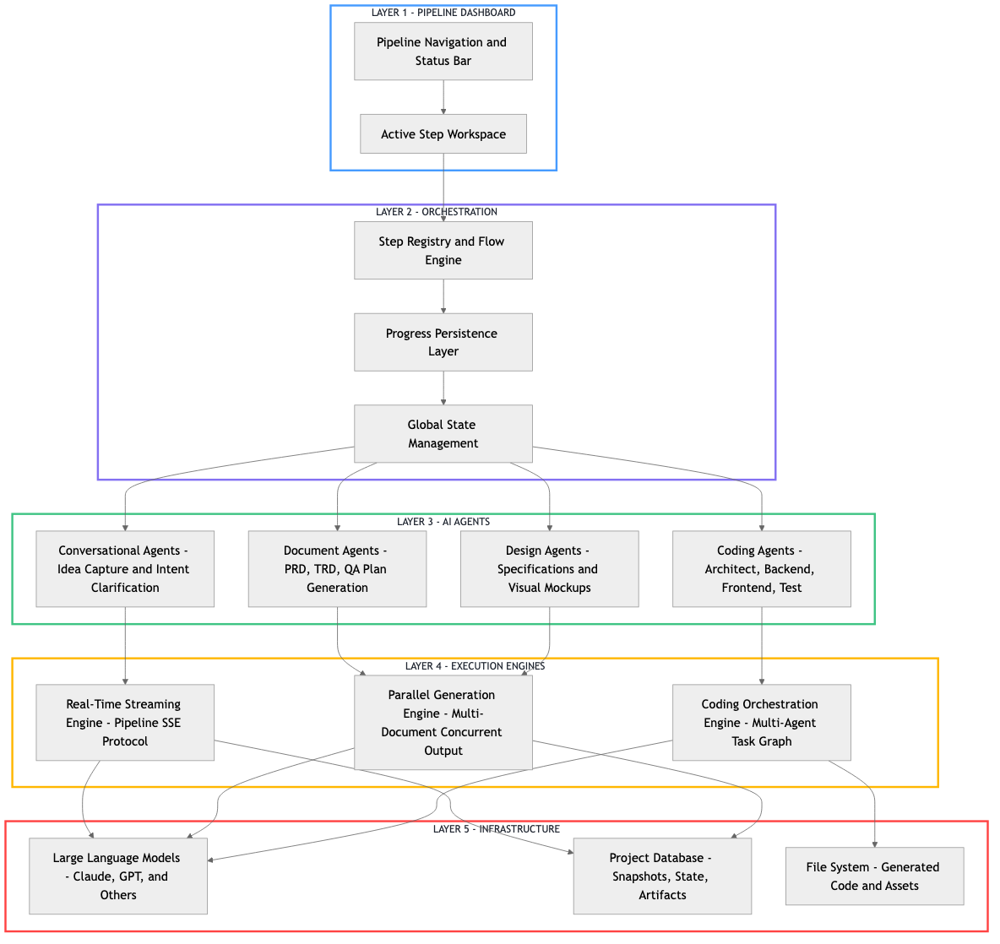
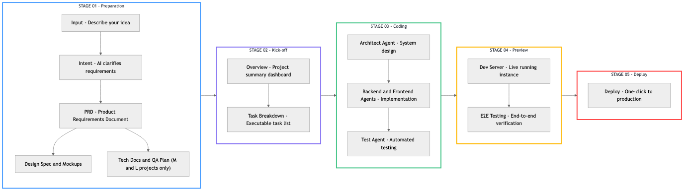
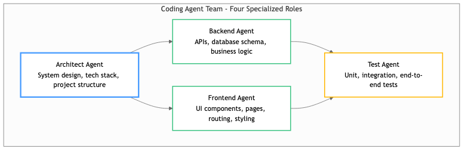

# The Agentic Builder Pod
## AI-Native Software Delivery Pipeline

---

*FIG 1: The Agentic Builder Pod — 15 AI agents across 5 stages, from idea to deployment, fully autonomous.*

## What Is It?

The Agentic Builder Pod is an AI-powered engine that takes a product idea from concept to deployment — **automatically**. Think of it as an autonomous delivery team where AI agents handle every phase of the software lifecycle: requirements, design, coding, testing, preview, and deployment.

Instead of hiring a team, writing specs, managing sprints, and waiting weeks for delivery, you describe what you want, and the Pod does the rest. It asks clarifying questions, generates documentation, writes code, runs tests, and deploys the finished product — all within a single, transparent workflow.

---

 

## Architecture Overview

*FIG 1: The Pod's layered architecture — 5 layers from UI Dashboard to Infrastructure. Each layer is independently scalable and observable.*

---

 

## Pipeline Overview

*FIG 2: The end-to-end pipeline — 5 stages from Preparation to Deploy. Each stage feeds into the next with full context preservation.*

---

 

## Stage 01: Preparation — From Idea to Blueprint

![Placeholder: Preparation Stage Screenshot — Input chat, Intent Q&A, PRD viewer]

*FIG 3: The Preparation stage in action — natural language input, AI-driven intent clarification, and auto-generated PRD.*

This is where raw ideas become actionable plans. The Pod takes your natural language description and transforms it into a complete project blueprint.

| Phase | What Happens | Why It Matters |
|---|---|---|
| **Input** | You describe your idea in plain language. No templates, no forms, no technical knowledge required. | Zero friction to start. Anyone can initiate a project. |
| **Intent** | AI asks smart clarifying questions, determines project complexity (S/M/L tier), and produces an enriched brief. | Eliminates ambiguity before any work begins. No more "that's not what I meant." |
| **PRD** | Generates a complete Product Requirements Document from the brief and intent context. | Stakeholder-ready documentation in minutes, not days. |
| **Design Spec** | Produces design specifications and visual mockups. | Design decisions are documented and reviewable, not lost in conversation. |
| **Tech Docs + QA** *(M/L projects)* | Technical requirements and quality assurance plans, generated in parallel. | Heavy projects get rigor without additional calendar time. |

**Tiering Logic**: Simple projects (Tier S) skip heavy documentation. Complex projects (Tier M/L) automatically include technical documentation and QA planning — no configuration needed.

 

---

## Stage 02: Kick-off — Planning the Work

![Placeholder: Kick-off Stage Screenshot — Overview panel and Task Breakdown view]

*FIG 4: The Kick-off stage — aggregated project overview and AI-generated task breakdown.*

The Pod aggregates everything from Preparation into a unified project summary, then decomposes the work into discrete, executable tasks. This is the bridge between "what to build" and "how to build it."

- **Overview Panel**: A consolidated dashboard of all preparation artifacts — scope, estimated effort, cost projections
- **Task Breakdown**: A granular, dependency-aware task list that feeds directly into the coding engine. Each task is independently executable and observable.

> "The Kick-off stage is where ambiguity ends and execution begins. Every task is defined, scoped, and ready for AI-driven development."

 

---

## Stage 03: Coding — Autonomous Development

![Placeholder: Coding Stage Screenshot — Agent workspace showing code generation, file tree, and live output]

*FIG 5: The Coding stage — multiple AI agents collaborating on architecture, implementation, and testing.*

This is the heart of the Pod. A team of specialized AI coding agents works in concert to build the entire application:

- The **Architect** designs the system — technology choices, project structure, data models
- **Backend** and **Frontend** agents implement in parallel, sharing context through a common task graph
- The **Test** agent writes and runs tests continuously, ensuring quality is built in from the start

All agents share full project context: requirements, design decisions, task assignments, and real-time file system state. You see progress as it happens — files being created, code being written, tests passing or failing — all streamed live to the dashboard.

 

---

## Stage 04: Preview — See It Before You Ship

![Placeholder: Preview Stage Screenshot — Dev Server console output and E2E test results]

*FIG 6: The Preview stage — live dev server and automated end-to-end testing.*

Before any code is deployed, the Pod validates everything in a live environment:

- **Dev Server**: Starts a running instance of the generated application. You can interact with it directly — click buttons, navigate pages, verify behavior.
- **E2E Testing**: Automated end-to-end tests verify that the entire application works correctly, from database to UI.

No "it works on my machine" surprises. The Pod runs and tests the actual application in real-time.

 

---

## Stage 05: Deploy — Ship With Confidence

![Placeholder: Deploy Stage Screenshot — deployment configuration and live deploy log]

*FIG 7: The Deploy stage — one-click deployment to your target environment.*

The final stage. The fully built, tested, and verified application is deployed to your target environment — complete with documentation, test reports, and a complete audit trail of every decision made along the pipeline.

> From idea to production — without a single handoff, status meeting, or context switch.

---

 

## Why It Matters

![Placeholder: Value Proposition Diagram — Speed, Transparency, Flexibility, Consistency comparison chart]

*FIG 8: The four pillars of value delivered by the Agentic Builder Pod.*

### Speed

A project that traditionally takes **2-3 weeks** with a team of 3-4 people (PM, designer, backend, frontend, QA) can move from idea to deployed application in **hours or days** — without compromising on documentation, testing, or quality.

### Transparency

Every step is visible in the pipeline dashboard. You see:
- What the AI is generating, in real-time (token-by-token streaming)
- What each step costs (per-step cost tracking)
- The status of every phase — idle, running, completed, failed
- Complete history — navigate back to any completed step to review or re-run

### Flexibility

- **Tiered delivery**: Not every project needs full technical documentation. The Pod adapts to project complexity automatically.
- **Edit and re-run**: Change requirements midway? Navigate back, edit, and re-run. Context is preserved downstream.
- **Parallel execution**: Independent steps run simultaneously — no waiting.

### Consistency

AI agents don't forget requirements, skip documentation, or make arbitrary decisions. Every project follows the same proven pipeline, producing consistent, high-quality outputs every time.

---

## Traditional vs. Pod

| Traditional Approach | Agentic Builder Pod |
|---|---|
| Multiple meetings to align on requirements | AI asks smart questions, clarifies in one pass |
| Docs written manually, often outdated | Documents generated and updated automatically |
| Coding sprints with context-switching overhead | AI agents code with full context, no switching |
| Testing is a separate phase, often rushed | Tests generated and run alongside code |
| Deployment is a manual ops task | One-click deploy from the pipeline |
| Status requires status meetings | Real-time visibility into every phase |

---

 

## Summary

![Placeholder: Summary Infographic — key metrics: time-to-delivery, cost savings, quality metrics]

*FIG 9: What the Agentic Builder Pod delivers.*

The Agentic Builder Pod replaces the traditional assembly line of humans passing documents and code between silos with a unified, AI-driven pipeline that handles every phase from idea to deployment. The result: **faster delivery, lower cost, consistent quality, and complete transparency.**

| Capability | How It Works |
|---|---|
| **Stateful workflow** | Progress is saved at every step. Navigate freely — no work is lost. |
| **Real-time streaming** | Watch AI agents generate output as it happens. |
| **Adaptive complexity** | Automatically adjusts scope based on project tier (S/M/L). |
| **Full traceability** | Every decision, document, and line of code is visible and reviewable. |
| **Extensible by design** | New steps and agent types can be added without disrupting the flow. |
